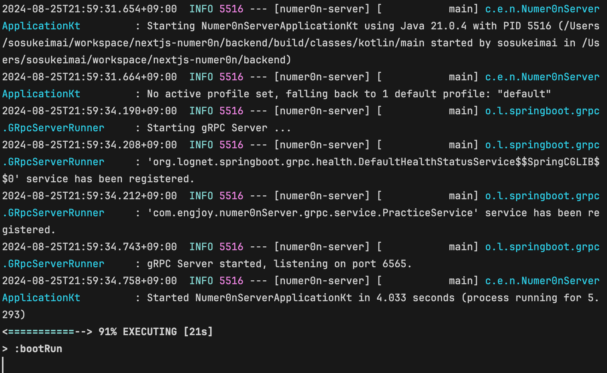
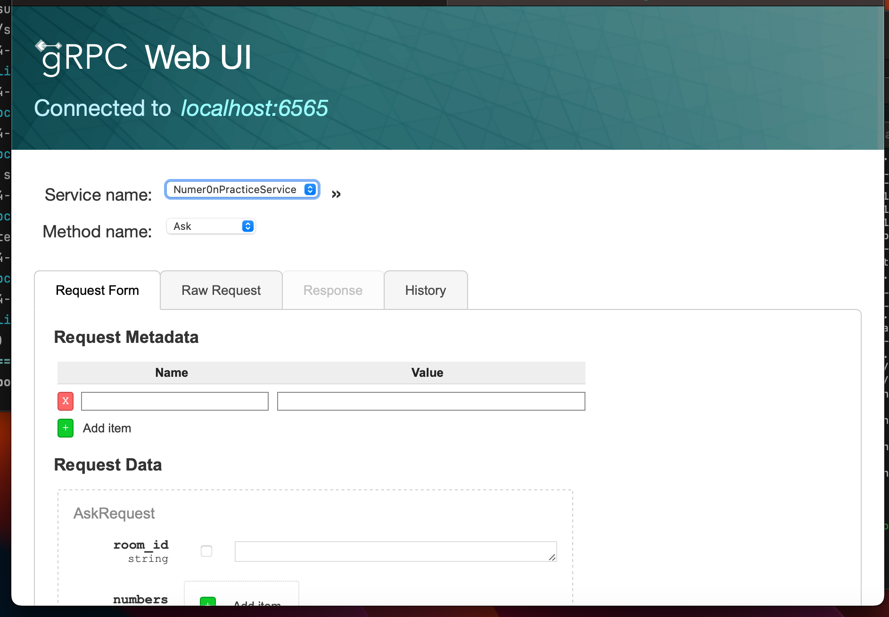
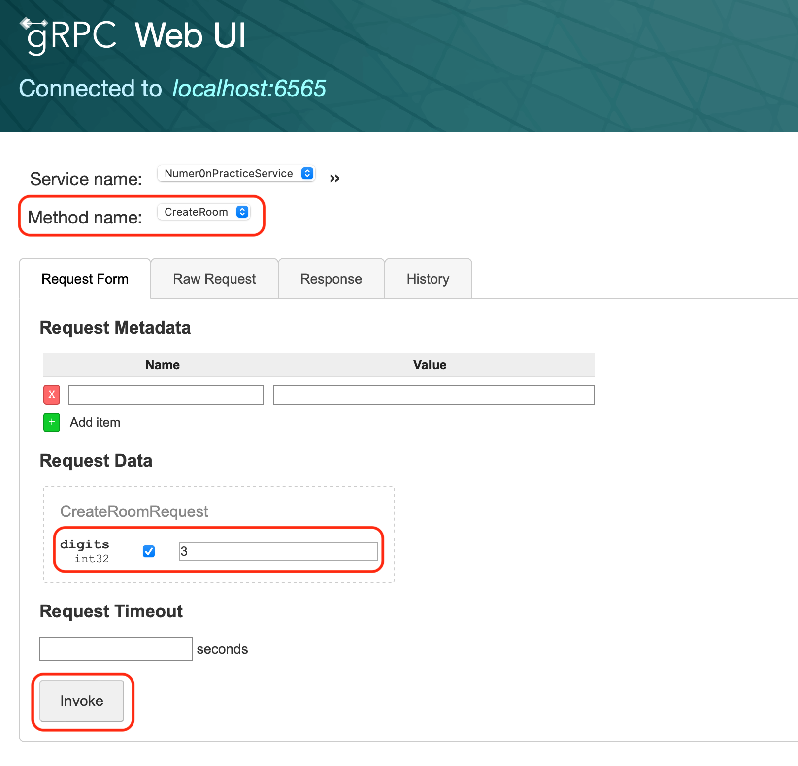
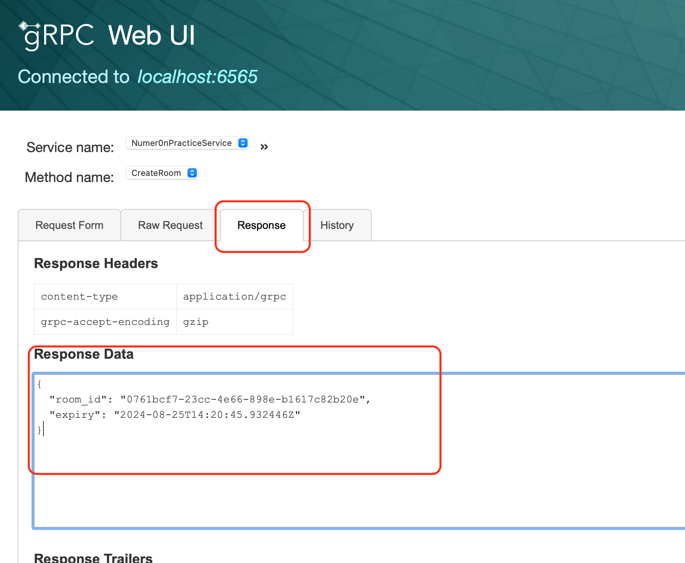
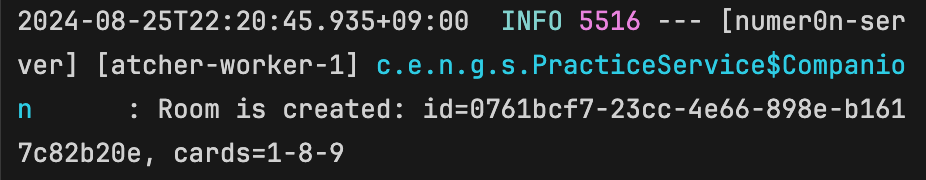
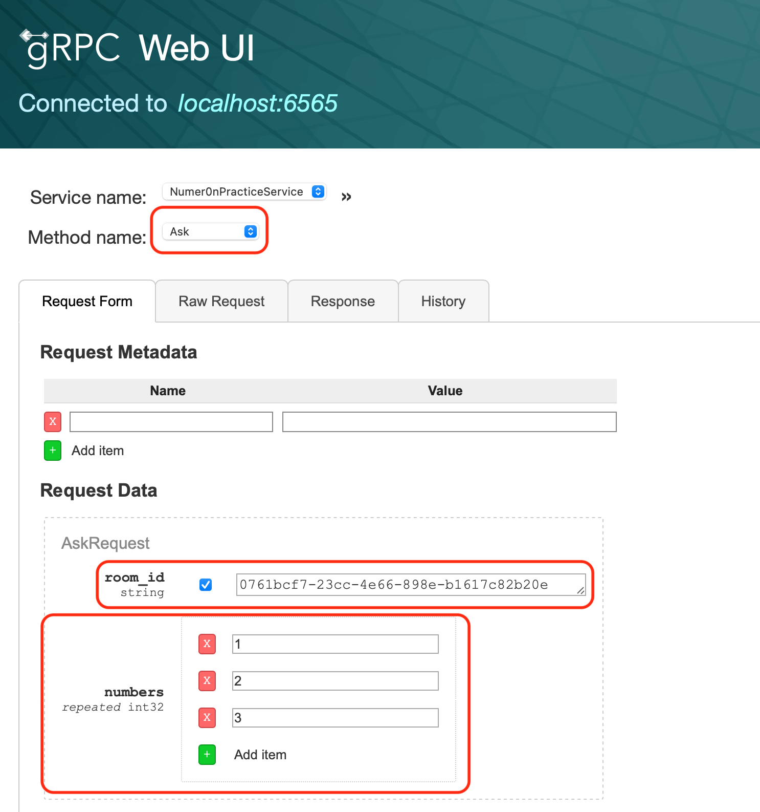
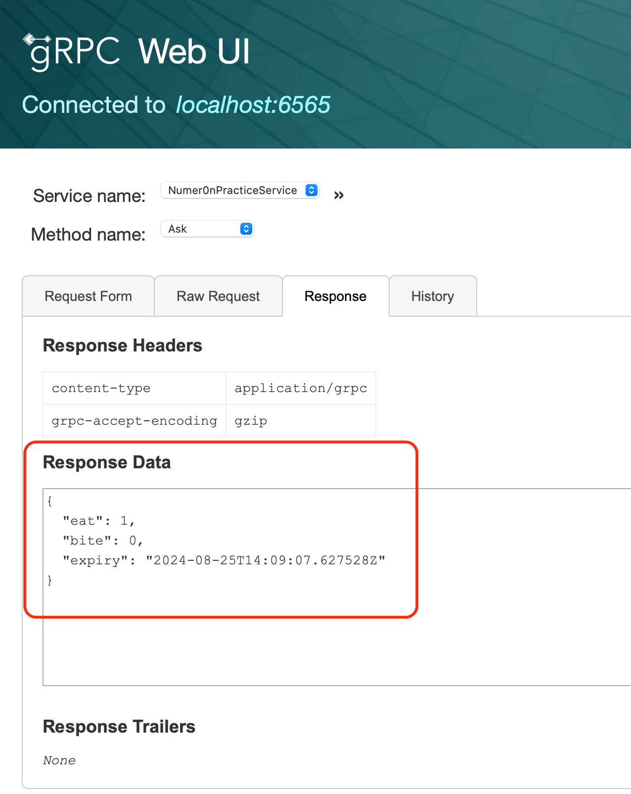
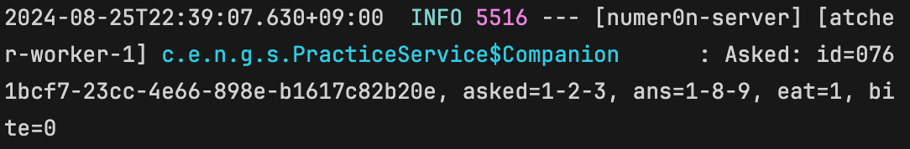

# 何が書かれてる？
環境構築、サーバーの立ち上げ方

ほぼこれ：[KotlinでgRPCサーバーを作ろう](https://creators.videomarket.co.jp/entry/2021/10/05/172724)

# 環境構築
* java21を[インストール](https://www.oracle.com/jp/java/technologies/downloads/#jdk21-windows)する
* IDEは動けばなんでも良いと思うが、[fleet](https://www.jetbrains.com/ja-jp/fleet/)など入れる
* リクエストの実験用ツールを入れる。こちらもなんでも良いが、[grpcui](https://github.com/fullstorydev/grpcui)など

# サーバーの立ち上げ方
* ```./gradlew bootRun --args='--spring.profiles.active=dev'```を実行する
    - gRPC特有のこととして、```../proto```から```src/main/proto```にコピーする、protoをkotlin用に変換する、というステップがある
    - ビルドに成功すると、以下のようなのが出るはず？

    - **何か手順を忘れていたらすいません、、教えてください、、**
* ```grpcui --plaintext localhost:6565```を叩く。6565はgrpcサーバーが立っているポート番号で、サーバー側のコンソールで見えるはず。
    - 以下のように、APIを直接呼ぶための画面が立ち上がります

# テスト実行
## 概要
* サーバー側にランダムなカードが生成されるモード（Numer0nPracticeService）のお話をします。
* gRPC Web UIのservice nameをそれにします。
* 各サービスには複数のメソッドが定義されており、このサービスでは以下が少なくともあるはず
    - Ask：対戦相手の持っているカードを当てるリクエスト
    - CreateRoom：対戦相手を作るリクエスト
 
## 手順

### CreateRoom
1. CreateRoomを選択し、digitsを3（相手のカード枚数）に設定、invokeをおす。
1. 実行すると、リターンがResponseタブに出てくる。 
1. サーバー側では、以下のような値が出てくる（カードはランダム）
1. 相手を指定するために、room_idをコピーする。

### Ask
1. 次に、Askメソッドに切り替える。
1. room_idに値を貼り付ける。numbersの欄を3つ作り、（重複しない）3つの数字を入れてinvokeする。
1. Responseにeat/biteなどが出ている
1. デバッグ用に、サーバー側では全部の値が出ている。
